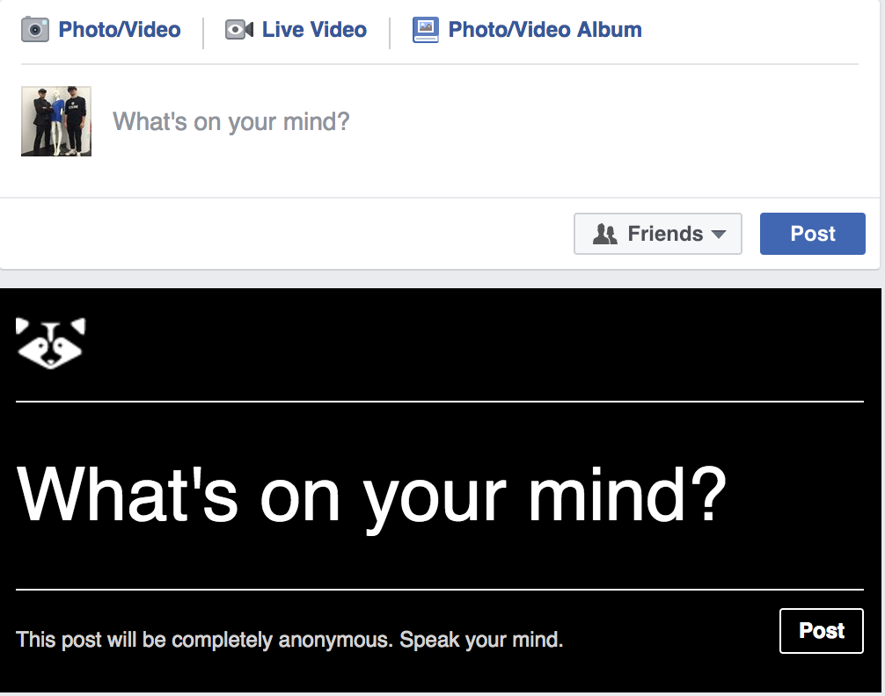

# Flip Feed

#### What is it?
Flip Feed is a browser extension that creates an anonymous posting board within your Facebook newsfeed!

#### Why would you want to use it?
Flip Feed is a community inside Facebook that intends to transport you outside your social bubble by giving you a space to share your thoughts and opinons with other flip-feed users. They can be Facebook freinds or not; it doesn't matter - so long as they have the browser extension!

Flip Feed is an anonymous space for a few reasons. Research has shown that real name registration policies are taking a toll on social media users contributions. Anonymity removes inhibition, allowing you to truly speak your mind without the fear of hurting your personal reputation. However, we all know that anonymity is a rich environment for trolls. It's both a blessing and a curse. To curtail trolls from creating an overly toxic environment, light moderation features such as downvoting and reactions will be implemented. 

Additonaly, Flip Feed offers a number of boards separated by topic. A free for all "Random" board, for instance, will offer the greatest amount of freedom for community members while boards such as "Politics" or "Q & A" will include tools that allow users to flag posts as irrelevent.

Community guidelines will be posted shortly.

A Beta is in progress and will be released on the chrome extension store by the end of May.

#### Some project goals
* Anonymous commenting and posting
* Uncensored
* Ephemeral
* Crowd moderated
* Communicate outside your social bubble
* Prosocial disinhibition
* Liberate users from Facebook rules.

